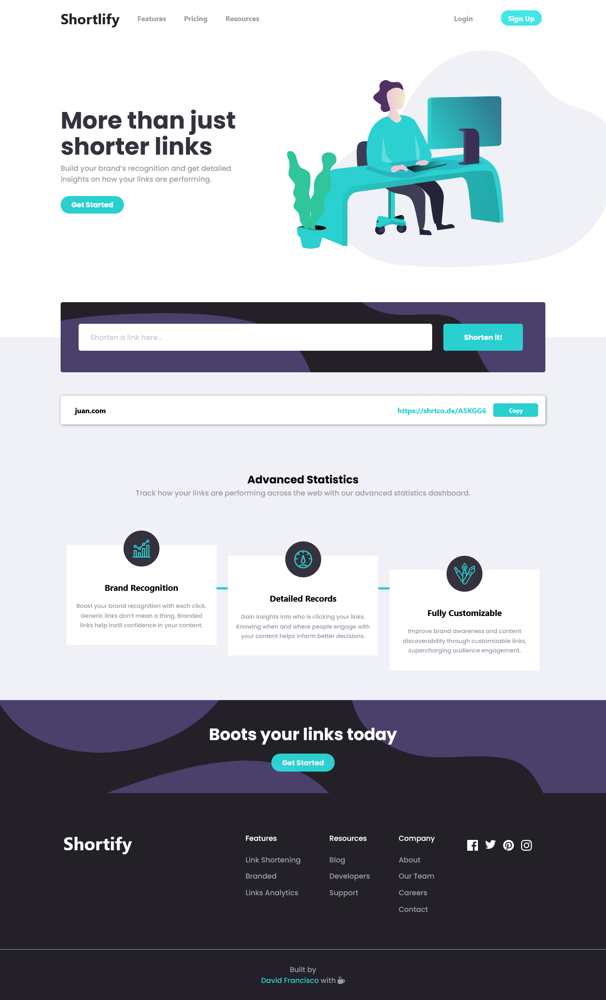

# Frontend Mentor - Shortly URL shortening API Challenge solution

This is a solution to the [Shortly URL shortening API Challenge challenge on Frontend Mentor](https://www.frontendmentor.io/challenges/url-shortening-api-landing-page-2ce3ob-G). Frontend Mentor challenges help you improve your coding skills by building realistic projects.

## Table of contents

- [Overview](#overview)
  - [The challenge](#the-challenge)
  - [Screenshot](#screenshot)
  - [Links](#links)
- [My process](#my-process)
  - [Built with](#built-with)
  - [What I learned](#what-i-learned)
  - [Continued development](#continued-development)
  - [Useful resources](#useful-resources)
- [Author](#author)

## Overview

### The challenge

Users should be able to:

- View the optimal layout for the site depending on their device's screen size
- Shorten any valid URL
- See a list of their shortened links, even after refreshing the browser
- Copy the shortened link to their clipboard in a single click
- Receive an error message when the `form` is submitted if:
  - The `input` field is empty

### Screenshot

### Links

- Live Site URL: (https://davidfcopozo.github.io/url-shortener-app/)

## My process

### Built with

- Semantic HTML5 markup
- CSS custom properties
- Flexbox
- CSS Grid
- Mobile-first workflow
- [React](https://reactjs.org/) - JS library
- [SASS](https://sass-lang.com/) - For styles

### What I learned

This is the first time using SASS in a project and it is amazing, of course, there are so many things yet to learn and put into practice, like modularizing the styles and so many awesome features but I will definitely use it in future projects making sure I use as many advantages as I can use off if this pre-processor.

### Continued development

One technology I'd love to work with in my next project is Next.js and render it from the Server Side since in commercial projects businesses need SEO optimization and that's something that SSR offers over CSR.

### Useful resources

- [Stack Overflow](https://stackoverflow.com/)
- [CSS-Tricks](https://css-tricks.com/)

## Author

- Website - [David Francisco](https://davidfrancisco.dev/)
- Frontend Mentor - [@davidfcopozo](https://www.frontendmentor.io/profile/davidfcopozo)
- Twitter - [@dadaicodes](https://www.twitter.com/dadaicodes)
